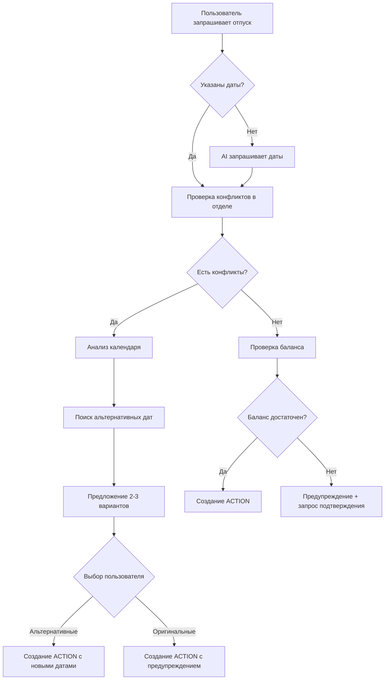

# 🤖 Умный AI Ассистент - Руководство по интеллектуальному бронированию отпусков

## 📋 Обзор новых возможностей

AI ассистент теперь работает как настоящий HR-специалист:
- ✅ Автоматически проверяет конфликты в отделе
- ✅ Предлагает альтернативные даты при конфликтах
- ✅ Запрашивает подтверждение перед отправкой заявки
- ✅ Поддерживает умную навигацию по страницам

---

## 🎯 Сценарии использования

### 1️⃣ Навигация по страницам

**Простые команды:**
```
🎤 "Покажи безопасность"           → Открывает /security
🎤 "Открой страницу сотрудников"   → Открывает /employees
🎤 "Покажи организации"            → Открывает /organizations
🎤 "Мой профиль"                   → Открывает /profile
🎤 "Show security"                 → Открывает /security
```

**Как это работает:**
- AI распознает намерение навигации
- Автоматически открывает нужную страницу
- Закрывает чат-окно после навигации

---

### 2️⃣ Умное бронирование отпуска (БЕЗ конфликтов)

**Сценарий:**
```
👤 Пользователь: "Хочу взять отпуск с 20 по 25 марта"

🤖 AI Ассистент: 
   "Отлично! Проверяю доступность...
   
   ✅ Период 20-25 марта свободен, нет конфликтов в вашем отделе.
   Баланс отпуска: 15 дней
   
   Отправить заявку на 6 дней отпуска?"

👤 Пользователь: "Да, отправь"

🤖 AI: [Создает ACTION и показывает кнопку подтверждения]
```

---

### 3️⃣ Умное бронирование с КОНФЛИКТОМ (основной сценарий)

**Сценарий:**
```
👤 Пользователь: "Организуй отпуск для меня с 10 по 15 марта"

🤖 AI Ассистент: 
   "Проверяю доступность вашего отдела...
   
   ⚠️ Обнаружен конфликт:
   - Иван Петров (Разработка) уже в отпуске: 12-14 марта
   - Это 33% от команды разработки
   
   📅 Рекомендую альтернативные даты:
   
   1️⃣ 17-22 марта (6 дней)
      ✅ Полное покрытие команды
      ✅ Нет конфликтов
   
   2️⃣ 24-29 марта (6 дней)
      ✅ Полное покрытие команды
      ✅ Нет конфликтов
   
   Какие даты предпочитаете: оригинальные (10-15) или альтернативные?"

👤 Пользователь: "17-22 марта подходит"

🤖 AI: 
   "Отлично! Бронирую 17-22 марта (6 дней)...
   [Создает ACTION с подтвержденными датами]"
```

---

### 4️⃣ Бронирование несмотря на конфликт

**Сценарий:**
```
👤 Пользователь: "Хочу отпуск с 10 по 15 марта"

🤖 AI: 
   "⚠️ Иван из вашего отдела уже в отпуске 12-14 марта.
   Рекомендую 17-22 марта (без конфликтов).
   
   Какие даты выбираете?"

👤 Пользователь: "Всё равно хочу 10-15"

🤖 AI: 
   "Понял. Отправляю запрос на 10-15 марта, несмотря на конфликт.
   Администратор учтет это при одобрении.
   [Создает ACTION с оригинальными датами]"
```

---

### 5️⃣ Бронирование для другого сотрудника (Admin/Supervisor)

**Сценарий:**
```
👤 Админ: "Организуй отпуск для Анны Сидоровой с 5 по 10 апреля"

🤖 AI: 
   "Проверяю доступность отдела Анны (Маркетинг)...
   
   ✅ Период свободен!
   Баланс Анны: 12 дней оплачиваемого отпуска
   
   Отправить заявку на 6 дней?"

👤 Админ: "Да"

🤖 AI: [Создает ACTION для Анны]
```

---

## 🔄 Логика работы AI

### Алгоритм принятия решений:



---

## 🧪 Тестовые сценарии

### Тест 1: Навигация
```
Команда: "покажи безопасность"
Ожидаемый результат: Открывается /security
```

### Тест 2: Простое бронирование
```
Команда: "хочу отпуск с 20 по 25 марта"
Ожидаемый результат: 
- AI проверяет конфликты
- Если нет конфликтов → показывает ACTION
- Если есть → предлагает альтернативы
```

### Тест 3: Бронирование с конфликтом
```
Шаг 1: Создать отпуск для сотрудника А: 12-14 марта
Шаг 2: От имени сотрудника Б (того же отдела): "отпуск с 10 по 15 марта"
Ожидаемый результат:
- AI находит конфликт с сотрудником А
- Предлагает альтернативные даты
- Ждет подтверждения
```

### Тест 4: Подтверждение альтернативных дат
```
После получения предложения альтернативных дат:
Команда: "давай 17-22 марта"
Ожидаемый результат: ACTION создается с датами 17-22 марта
```

---

## 📊 Критерии качества

### AI должен:
- ✅ Всегда проверять конфликты перед созданием ACTION
- ✅ Предлагать минимум 2 альтернативных варианта при конфликте
- ✅ Указывать причины рекомендаций (% загрузки отдела)
- ✅ Ждать явного подтверждения от пользователя
- ✅ Отвечать на том же языке, что и пользователь

### AI НЕ должен:
- ❌ Создавать ACTION без проверки конфликтов
- ❌ Создавать ACTION без подтверждения при наличии конфликтов
- ❌ Предлагать даты без анализа календаря
- ❌ Игнорировать загрузку отдела (>30% = критично)

---

## 🔧 Технические детали

### Источники данных для AI:

1. **USER CONTEXT** - баланс отпусков текущего пользователя
2. **COMPLETE SYSTEM DATA** - все сотрудники с их отпусками
3. **CALENDAR** - одобренные отпуска на 90 дней вперед
4. **AI INSIGHTS** - рекомендованные даты, конфликты

### Формат ACTION:
```json
{
  "type": "BOOK_LEAVE",
  "leaveType": "paid",
  "startDate": "2026-03-17",
  "endDate": "2026-03-22",
  "days": 6,
  "reason": "Vacation"
}
```

---

## 🎓 Примеры использования

### Пример 1: Быстрое бронирование
```
"хочу отпуск на следующей неделе"
→ AI определяет даты следующей недели
→ Проверяет конфликты
→ Предлагает ACTION или альтернативы
```

### Пример 2: Информационный запрос
```
"кто из моего отдела в отпуске в марте?"
→ AI показывает список без создания ACTION
```

### Пример 3: Комплексный запрос
```
"когда лучше взять отпуск в марте, чтобы не было конфликтов?"
→ AI анализирует календарь
→ Предлагает оптимальные даты
→ После выбора пользователя создает ACTION
```

---

## 📝 Заметки для разработчиков

- Логика подтверждения реализована через промпт AI (без изменения frontend)
- AI использует контекстную память разговора для отслеживания подтверждений
- Конфликты определяются по полю `department` в USER CONTEXT
- Альтернативные даты ищутся в пределах ±30 дней от запрошенного периода

---

**Дата обновления:** 4 марта 2026  
**Версия:** 2.0 - Интеллектуальное бронирование с конфликт-анализом
