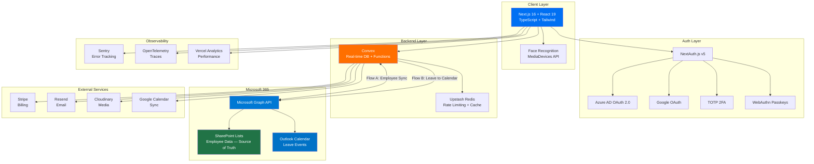

<div align="center">

# 🏢 HR Office Platform

[](https://github.com/roma-frontend/hr-project/actions)
[]()
[]()
[]()
[]()
[]()
[-000000?logo=vercel&logoColor=white>)](https://hr-project-sigma.vercel.app)

**All-in-One HR Management SaaS Platform**

[Live Demo](https://hr-project-sigma.vercel.app) · [Report Bug](https://github.com/roma-frontend/hr-project/issues) · [Request Feature](https://github.com/roma-frontend/hr-project/issues)

</div>

---

## 📋 Table of Contents

- [About](#-about)
- [Features](#-features)
- [Tech Stack](#-tech-stack)
- [Architecture](#-architecture)
- [Getting Started](#-getting-started)
- [Environment Variables](#-environment-variables)
- [Project Structure](#-project-structure)
- [Testing](#-testing)
- [Deployment](#-deployment)
- [Security](#-security)
- [Internationalization](#-internationalization)
- [API Reference](#-api-reference)
- [Contributing](#-contributing)
- [Roadmap](#-roadmap)
- [License](#-license)

---

## 🎯 About

**HR Office** is a comprehensive, enterprise-grade HR management platform that centralizes all HR operations into a single, real-time application. Built for organizations that need modern workforce management — from employee lifecycle and attendance tracking (with face recognition) to AI-powered analytics and Microsoft 365 integration.

### The Problem

HR processes are typically fragmented across multiple disconnected tools:

- Employee data scattered in spreadsheets and SharePoint lists
- Leave requests handled via email with no calendar visibility
- Attendance tracked manually — error-prone and time-consuming
- No centralized task management or real-time analytics

### The Solution

HR Office replaces all fragmented tools with a **unified platform** — zero manual data entry, single source of truth synced from SharePoint, and automated Outlook Calendar integration for approved leaves.

---

## ✨ Features

| Module                      | Description                       | Highlights                                                          |
| --------------------------- | --------------------------------- | ------------------------------------------------------------------- |
| 👤 **Employee Lifecycle**   | Full employee profile management  | Documents, performance metrics, onboarding/offboarding              |
| 🔐 **Face Recognition**     | Biometric attendance check-in/out | Browser-based camera, daily logs, anomaly detection                 |
| 📅 **Leave Management**     | End-to-end leave workflow         | Multi-level approval, auto Outlook Calendar sync, entitlement rules |
| 📋 **Task Management**      | Kanban board with drag-and-drop   | Assignment, deadlines, progress tracking, notifications             |
| 💬 **Team Chat**            | Real-time messaging               | File sharing, channels, direct messages                             |
| 🤖 **AI HR Assistant**      | Conversational HR chatbot         | Policy Q&A, smart insights, analytics queries                       |
| 🚗 **Driver Management**    | Vehicle/driver booking system     | Availability tracking, scheduling, route management                 |
| 📊 **AI Analytics**         | Workforce intelligence dashboard  | Headcount trends, leave patterns, attendance heatmaps               |
| 🔗 **M365 Integration**     | SharePoint + Outlook sync         | Auto employee sync, calendar events for leave                       |
| 💳 **Multi-Tenant Billing** | Stripe subscription management    | Plans, invoicing, usage tracking                                    |

### Role-Based Access Control (5 Roles)

| Role           | Permissions                                        |
| -------------- | -------------------------------------------------- |
| **Superadmin** | Full system access, tenant management, billing     |
| **Admin**      | Organization settings, user management, approvals  |
| **Supervisor** | Team management, leave/task approvals, reports     |
| **Employee**   | Self-service: profile, leave requests, tasks, chat |
| **Driver**     | Booking management, availability, schedule view    |

---

## 🛠 Tech Stack

### Frontend

| Technology                                        | Purpose                       |
| ------------------------------------------------- | ----------------------------- |
| [Next.js 16](https://nextjs.org/)                 | React framework (SSR/SSG/ISR) |
| [React 19](https://react.dev/)                    | UI library                    |
| [TypeScript 5.x](https://www.typescriptlang.org/) | Type safety                   |
| [Tailwind CSS](https://tailwindcss.com/)          | Utility-first styling         |
| [Shadcn/ui](https://ui.shadcn.com/)               | Accessible component library  |

### Backend & Database

| Technology                            | Purpose                                   |
| ------------------------------------- | ----------------------------------------- |
| [Convex](https://www.convex.dev/)     | Real-time database + serverless functions |
| [NextAuth.js v5](https://authjs.dev/) | Authentication framework                  |
| [Upstash Redis](https://upstash.com/) | Rate limiting & caching                   |

### Integrations

| Service                                                                   | Purpose                            |
| ------------------------------------------------------------------------- | ---------------------------------- |
| [Microsoft Graph API](https://learn.microsoft.com/en-us/graph/)           | SharePoint sync + Outlook Calendar |
| [Google Calendar API](https://developers.google.com/calendar)             | Calendar sync (alternative)        |
| [Stripe](https://stripe.com/)                                             | Subscription billing               |
| [Resend](https://resend.com/)                                             | Transactional email                |
| [Cloudinary](https://cloudinary.com/)                                     | Media storage & optimization       |
| [Sentry](https://sentry.io/) + [OpenTelemetry](https://opentelemetry.io/) | Error tracking & observability     |

### DevOps

| Tool                                                             | Purpose                    |
| ---------------------------------------------------------------- | -------------------------- |
| [Vercel](https://vercel.com/) (EU, fra1)                         | Hosting & Edge Functions   |
| [GitHub Actions](https://github.com/features/actions)            | CI/CD pipeline             |
| [Playwright](https://playwright.dev/)                            | E2E testing                |
| [Jest](https://jestjs.io/) + [RTL](https://testing-library.com/) | Unit & integration testing |

---

## 🏗 Architecture



### Data Flows

```
Flow A (Employee Sync):
SharePoint List → Microsoft Graph API → Convex DB → HR Office UI

Flow B (Leave Calendar Sync):
HR Office (Leave Approved) → Convex Action → Microsoft Graph API → Outlook Calendar Event
```

---

## 🚀 Getting Started

### Prerequisites

- **Node.js** 20+ (LTS recommended)
- **npm** 10+ or **pnpm** 9+
- **Convex account** — [sign up free](https://dashboard.convex.dev)
- **Vercel account** — [sign up free](https://vercel.com/signup)

### Installation

```bash
git clone https://github.com/roma-frontend/hr-project.git
cd hr-project
npm install
npx convex dev
cp .env.example .env.local
npm run dev
```

### Quick Commands

```bash
npm run dev          # Start development server + Convex sync
npm run build        # Production build
npm run start        # Start production server
npm run lint         # ESLint check
npm run type-check   # TypeScript type check
npm run test         # Run unit tests
npm run test:e2e     # Run Playwright E2E tests
npm run test:coverage # Run tests with coverage report
```

---

## 🔑 Environment Variables

Create `.env.local` from `.env.example`:

```bash
# CONVEX
CONVEX_DEPLOYMENT=
NEXT_PUBLIC_CONVEX_URL=

# AUTHENTICATION — NextAuth.js v5
NEXTAUTH_SECRET=
NEXTAUTH_URL=http://localhost:3000

# MICROSOFT 365 / AZURE AD (Entra ID)
MICROSOFT_CLIENT_ID=
MICROSOFT_CLIENT_SECRET=
MICROSOFT_TENANT_ID=
SHAREPOINT_SITE_ID=
SHAREPOINT_LIST_ID=

# GOOGLE OAUTH
GOOGLE_CLIENT_ID=
GOOGLE_CLIENT_SECRET=

# STRIPE (Billing)
STRIPE_SECRET_KEY=
STRIPE_PUBLISHABLE_KEY=
STRIPE_WEBHOOK_SECRET=

# RESEND (Email)
RESEND_API_KEY=

# CLOUDINARY (Media Storage)
CLOUDINARY_CLOUD_NAME=
CLOUDINARY_API_KEY=
CLOUDINARY_API_SECRET=

# UPSTASH REDIS (Rate Limiting & Cache)
UPSTASH_REDIS_REST_URL=
UPSTASH_REDIS_REST_TOKEN=

# SENTRY (Error Monitoring)
SENTRY_DSN=
SENTRY_AUTH_TOKEN=

# FEATURE FLAGS
NEXT_PUBLIC_ENABLE_FACE_RECOGNITION=true
NEXT_PUBLIC_ENABLE_AI_ASSISTANT=true
NEXT_PUBLIC_ENABLE_DRIVER_MODULE=true
```

---

## 📁 Project Structure

```
hr-project/
├── .github/workflows/ci.yml
├── app/
│   ├── (auth)/
│   ├── (dashboard)/
│   │   ├── employees/
│   │   ├── attendance/
│   │   ├── leaves/
│   │   ├── tasks/
│   │   ├── chat/
│   │   ├── ai-assistant/
│   │   ├── drivers/
│   │   ├── analytics/
│   │   ├── settings/
│   │   └── billing/
│   └── api/
├── components/
├── convex/
├── lib/
├── hooks/
├── locales/ (en.json, ru.json, hy.json)
├── types/
├── tests/
├── TEST_PLAN.md
└── README.md
```

---

## 🧪 Testing

See **[TEST_PLAN.md](./TEST_PLAN.md)** for 82 test cases across 14 modules.

| Category               | Target | Gate     |
| ---------------------- | ------ | -------- |
| **Statements**         | ≥ 80%  | Required |
| **Branches**           | ≥ 75%  | Required |
| **Functions**          | ≥ 80%  | Required |
| **Lines**              | ≥ 80%  | Required |
| **E2E Critical Paths** | 100%   | Required |

---

## 🚢 Deployment

Deployed on **Vercel** in **EU (fra1)** for GDPR compliance.

```bash
git push origin main    # Auto-deploy
vercel --prod           # Manual deploy
```

---

## 🔒 Security

| Layer                | Implementation                                |
| -------------------- | --------------------------------------------- |
| **Authentication**   | OAuth 2.0 (Azure AD + Google), NextAuth.js v5 |
| **Multi-Factor**     | TOTP 2FA + WebAuthn Passkeys                  |
| **Biometric**        | Face Recognition (attendance)                 |
| **Password Hashing** | bcrypt (12 rounds)                            |
| **Authorization**    | Convex RLS, 5-tier RBAC                       |
| **Transport**        | HSTS, TLS 1.3                                 |
| **XSS Prevention**   | CSP headers                                   |
| **Rate Limiting**    | Upstash Redis                                 |
| **Monitoring**       | Sentry + OpenTelemetry                        |

---

## 🌐 Internationalization

| Code | Language    | Status      |
| ---- | ----------- | ----------- |
| `en` | 🇬🇧 English  | ✅ Complete |
| `ru` | 🇷🇺 Russian  | ✅ Complete |
| `hy` | 🇦🇲 Armenian | ✅ Complete |

---

## 🤝 Contributing

1. Fork → 2. Branch (`feature/x`) → 3. Commit (Conventional Commits) → 4. Push → 5. PR

---

## 🗺 Roadmap

- [x] Employee lifecycle, Face recognition, Leave management, Tasks, Chat, AI, Drivers, Analytics
- [x] Microsoft 365 integration, Stripe billing, i18n (EN/RU/HY)
- [ ] Mobile app (React Native), Performance reviews, Payroll, E-signatures, PDF export

---

## 📄 License

MIT License

---

## 👨‍💻 Author

**Roman Gulanyan** — [@roma-frontend](https://github.com/roma-frontend) — romangulanyan@gmail.com

<div align="center">Built with ❤️ using Next.js + Convex + Microsoft 365</div>
